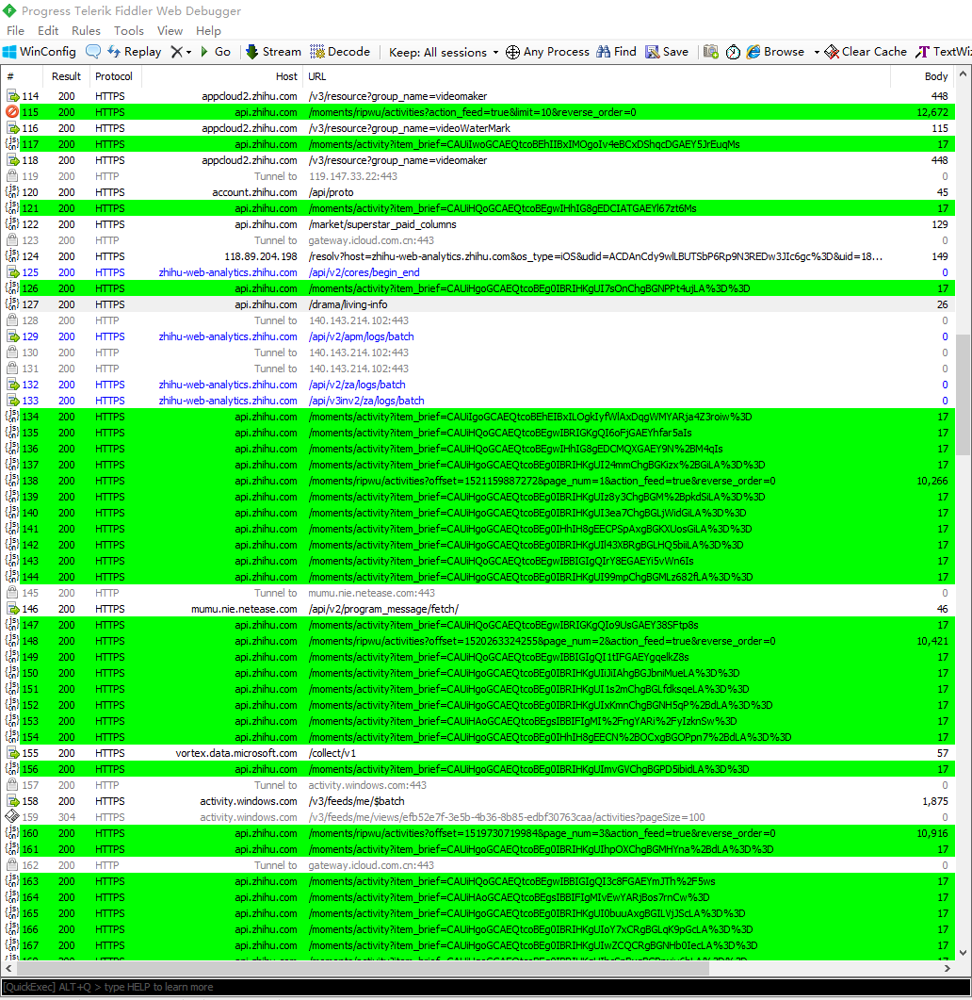

# 背景
知乎使用了几年，个人动态数量有很多，但知乎的隐私设置很让人无法，动态在web端无法删除，只能在app上逐条操作，没有批量删除的接口，因此手动操作是不可能的了，只能脚本处理。

# 实现
知乎识别了模拟器，因此无法直接wireshark抓包，必须借助手机
我的方式是在PC上通过fiddler设置代理并导出证书(.cer)，在iPhone上配置代理并信任证书
然后使用fiddler Custom Rules根据API批量爬取并删除动态



# 脚本

```js
    import System.Threading;

    static function OnBeforeResponse(oSession: Session) {
        if (m_Hide304s && oSession.responseCode == 304) {
            oSession["ui-hide"] = "true";
        }

		if(oSession.HostnameIs("api.zhihu.com") && oSession.uriContains("moments/activity?item_brief=")) {
			oSession["ui-backcolor"] = "lime";
		}

		if(oSession.HostnameIs("api.zhihu.com") && oSession.uriContains("moments/") && oSession.uriContains("/activities?") && oSession.uriContains("action_feed=true")) {
			oSession["ui-backcolor"] = "lime";

			oSession.utilDecodeResponse();
			var oBody = System.Text.Encoding.UTF8.GetString(oSession.responseBodyBytes);
			var rsp = Fiddler.WebFormats.JSON.JsonDecode(oBody);

			{
				var data = rsp.JSONObject["data"];
				for (var i = 0; i < data.Count; i++){
					var raw = "DELETE " + "https://api.zhihu.com/moments/activity?item_brief=" + Utilities.UrlEncode(data[i]['brief']) + " HTTP/1.1\r\n";
					FiddlerApplication.Log.LogString(raw);

					for (var j = 0; j < oSession.oRequest.headers.Count(); j++) {
						var header = oSession.oRequest.headers[j];
						raw += header + "\r\n";
					}

					raw += "\r\n" + oSession.GetRequestBodyAsString();
					FiddlerObject.utilIssueRequest(raw);
					Thread.Sleep(1000)
				}
			}

			{
				var raw = "GET " + rsp.JSONObject["paging"]['next'] + "&action_feed=true&reverse_order=0" + " HTTP/1.1\r\n";
				FiddlerApplication.Log.LogString(raw);

				for (var j = 0; j < oSession.oRequest.headers.Count(); j++) {
					var header = oSession.oRequest.headers[j];
					raw += header + "\r\n";
				}

				raw += "\r\n" + oSession.GetRequestBodyAsString();
				FiddlerObject.utilIssueRequest(raw);
				Thread.Sleep(1000)
			}
		}
    }
```
